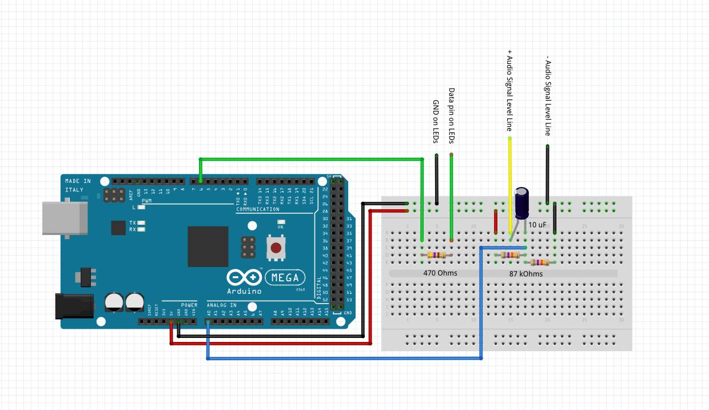

# LED BPM Music Visualizer
## Ryan Kane

Arduino program that detects Beats from an 3.5 mm audio jack. [The source for the audio signal circuit and BPM filter code can be found here](https://www.hackster.io/Joao_Claro/arduino-beat-detector-d0a21f)
The program detects the beats in the song, and creates a waveform like wave down the string of LEDS.

### Circuit Diagram

The Arduino can read input signals from 0 - 5V DC, but the audio signal is an AC signal centered around 0V. Therefore, to stop the Arduino from only capturing the positive part of the signal, a tension divider is used to shift the signal center from 0V to 2.5V. The capacitor is used to stop the DC signal from traveling back toward the audio signal, which would possibly damage the Arduino.
